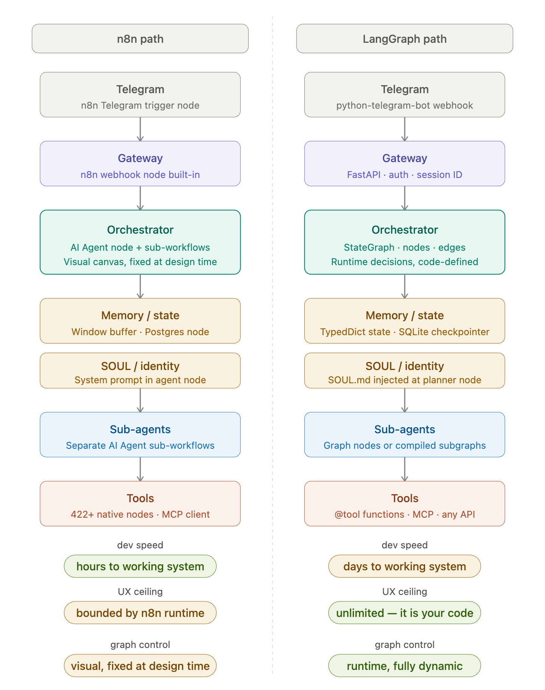

# Architectural Decision Record: n8n vs LangGraph

## Status

> What is the status, such as proposed, accepted, rejected, deprecated, superseded, etc.?

Accepted

## Context

> What is the issue that we're seeing that is motivating this decision or change?

We need to decide on the base architecture for our project. The two main contenders are n8n and LangGraph.

## Decision

> What is the change that we're proposing and/or doing?

n8n is a powerful workflow automation tool. I already have experience with it and it's backed by a strong community support.
Therefore, we will use n8n as the base architecture for our project scaffolding, at least for the first iteration.

## Consequences

> What becomes easier or more difficult to do because of this change?

Using n8n will allow us to quickly set up and automate workflows without needing to build everything from scratch.
It also has a large library of pre-built integrations which can save us time.

However, it may limit our flexibility in terms of customization compared to building our own architecture with LangGraph.
We will need to evaluate the trade-offs as we move forward with development, but for now, n8n is perfectly suitable for our needs.

- **Dev speed**: n8n enables rapid prototyping with pre-built nodes; LangGraph requires manual wiring.
- **UX ceiling**: LangGraph offers more flexibility for custom logic; n8n is limited by node capabilities.
- **Graph control**: n8n's graph is static; LangGraph allows dynamic, runtime graph evaluation.

- **Hybrid approach**: Use n8n for integrations and interface, delegate orchestration to LangGraph via HTTP.

- **Short term**: Build MVP in n8n for speed and iteration.
- **Midterm**: Migrate orchestration to LangGraph endpoint after MVP.

## Decision Drivers

_(open file for editing -- [n8n_vs_langgraph.html](resources/n8n_vs_langgraph.html))_

## Summary

